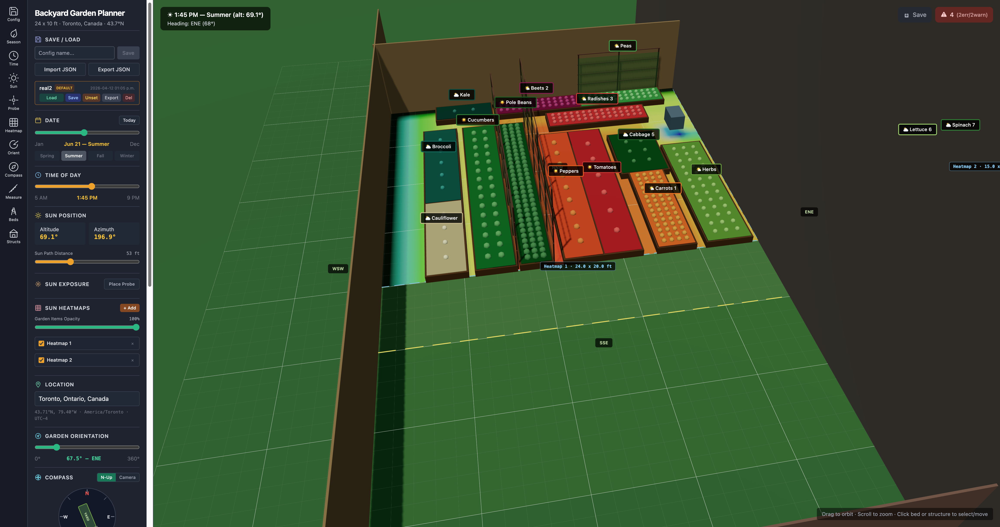
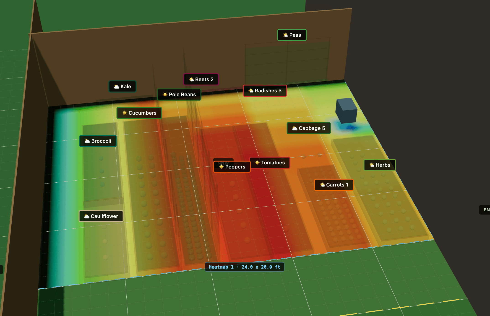
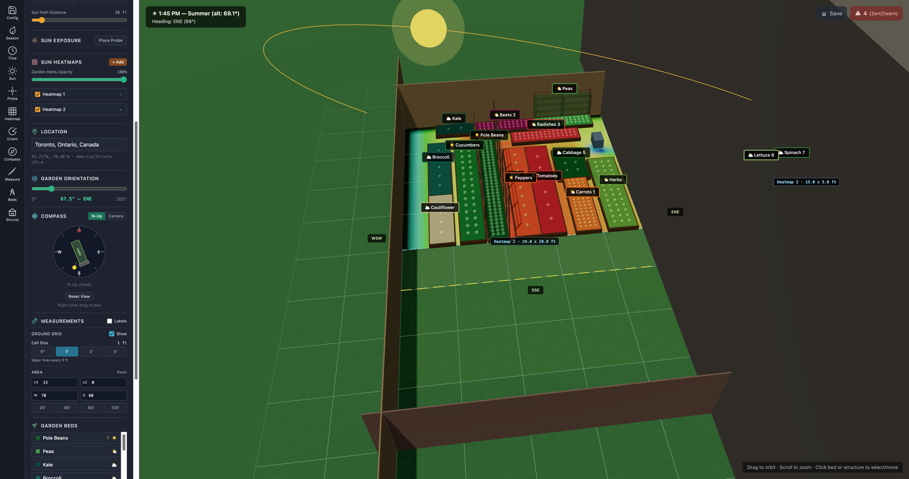

<div align="center">


# Garden Planner

**A 3D sun-aware garden bed planner for real backyards.**

Pick any of 1000 world cities, scrub through the day or the season, and see exactly where your garden beds get light — shadows cast from buildings and fences included.


</div>

---

## What it is

Garden Planner is an interactive 3D tool for planning a garden in a specific physical space. You model your yard, drop in beds and structures, pick your location, and the app computes real sun exposure — cast shadows, peak sun hours, and all — so you can decide where a sun-hungry tomato will actually thrive and where the kale should go.

It started as a planner for a 24 × 10 ft backyard in Ontario and has grown into a general-purpose tool that works anywhere in the world.

## Features

- **Worldwide sun math.** Pick any of 1000 large cities (sourced from GeoNames). The app computes latitude, longitude, and DST-aware timezone offsets, and corrects clock time to apparent solar time using the [Equation of Time](https://en.wikipedia.org/wiki/Equation_of_time). Solar noon lands where it actually should — ~13:19 in Ontario on the summer solstice, not 12:00.
- **3D scene.** Interactive canvas built on `@react-three/fiber` with orbit/pan/zoom, selectable beds and structures, drag-to-move transform gizmos, and measurement labels.
- **Sun path visualization.** Watch the sun arc through the sky for any day of the year. A configurable viz dome keeps the arc at a comfortable viewing distance.
- **Shadow-aware heatmaps.** Ray-AABB shadow casting against user-placed buildings and fences, plus a multi-instance heatmap overlay that shows direct sun hours, peak sun hours, peak intensity, or energy rating across any rectangular region.
- **Plant-aware garden beds.** Curated plant presets (tomato, kale, lettuce, peppers, etc.) with real peak-sun-hour requirements baked in. Alerts flag beds whose sun exposure is below what their plants need.
- **Structures with shadows.** Add buildings, sheds, fences, and trellises. Position, size, color, and shadow-casting are all editable.
- **Save / load configs.** Named configs persist to localStorage with JSON export/import. Location and heatmap state round-trip cleanly.

## Demo

<div align="center">


*Scrubbing through the day, toggling heatmap, and rearranging beds in real time.*

</div>

## Screenshots

<div align="center">



*Main view — sun arc, garden beds, structures, and the sidebar in default framing.*



*Peak-sun-hours heatmap overlay with labeled beds — red zones get the most direct sun, blue zones are shaded by the fence and cold frame. Exactly the kind of map you need to decide where tomatoes go vs. kale.*



*Morning shadows cast from structures at a low sun angle.*

</div>

## Tech stack

| Layer | Tooling |
|---|---|
| UI | React 18, TypeScript 5 |
| 3D | Three.js (r169), `@react-three/fiber`, `@react-three/drei` |
| Styling | Tailwind CSS 3 |
| Build | Vite 6 |
| Runtime | Bun (dev/build scripts — falls back to Node + npm fine) |

## Getting started

```bash
# Install dependencies
bun install

# Start the dev server (http://localhost:5173)
bun run dev

# Typecheck + production build
bun run build

# Preview the production build
bun run preview
```

If you don't have Bun, `npm install` / `npm run dev` / `npm run build` work too — Vite is the actual build tool.

## Project layout

```
src/
├── App.tsx           Root component. All top-level state (location, time, structures,
│                     beds, heatmaps) lives here and flows down as props.
├── Scene.tsx         Three.js canvas, orbit controls, lighting, ground plane,
│                     structures, garden beds, sun visualization, heatmap overlay.
├── sun.ts            Solar geometry — declination, altitude, azimuth, ray-AABB
│                     shadow casting, heatmap grid generation, Equation of Time.
├── cities.ts         1000 world cities (GeoNames derived) with lat/lon/tz, plus
│                     a DST-resolving Intl-based timezone offset helper.
├── CityPicker.tsx    Reusable searchable combobox for the city list.
├── types.ts          TypeScript interfaces for beds/structures/config + plant presets.
├── BedPanel.tsx      Sidebar panel: garden bed CRUD.
├── StructurePanel.tsx Sidebar panel: structures (buildings, fences) CRUD.
├── ConfigPanel.tsx   Sidebar panel: save/load, localStorage, JSON import/export.
├── AlertPanel.tsx    Sidebar panel: bed alerts (insufficient sun, wrong spacing).
├── NavSidebar.tsx    Section navigation sidebar.
└── SectionHeader.tsx Shared sidebar section header + icon set.
```

## How the sun math works

`sun.ts` computes apparent sun position from:

1. **Solar declination** — a trig approximation keyed on day-of-year.
2. **Hour angle** — but first, the civil clock hour is converted to *apparent solar time* via `apparentSolarHour()`, which applies:
   - The Local Standard Time Meridian offset (`15° × tzOffsetHours`),
   - The longitude delta from that meridian (4 minutes per degree),
   - The Spencer-derived Equation of Time (±16 min seasonal correction).
3. **Latitude-aware spherical trig** — yields altitude and azimuth.
4. **Yard heading rotation** — rotates the compass azimuth into the scene's local coordinate frame.

The timezone offset itself is resolved from the city's IANA timezone via `Intl.DateTimeFormat` for the currently-selected day-of-year, so scrubbing across a DST boundary just works.

Shadow casting uses cheap ray-AABB intersection tests against the bounding boxes of every shadow-casting structure. The heatmap precomputes sun positions once per day and iterates grid cells, which keeps the grid interactive at 1 ft resolution across the whole yard.

## Data attribution

City data is derived from [GeoNames cities15000](https://www.geonames.org/) (top 1000 by population), distributed under [CC BY 4.0](https://creativecommons.org/licenses/by/4.0/). The original dataset includes many more fields than this project ships — `src/cities.ts` keeps only name, admin region, country, latitude, longitude, and IANA timezone.

## Roadmap ideas

- Multi-day sun exposure comparisons (spring vs summer shadow shifts).
- Map picker as an alternative to the city dropdown.
- Irrigation zones and soil-type tagging per bed.
- Vegetation that casts its own shadows (mature trees, trellises).
- Import/export of full 3D scenes to GLTF.

## License

MIT — see [LICENSE](LICENSE).

Note that the city data shipped in `src/cities.ts` is derived from GeoNames and remains under [CC BY 4.0](https://creativecommons.org/licenses/by/4.0/) — attribution is preserved in the file header.
